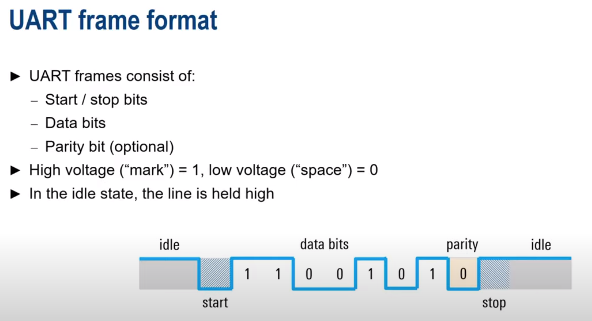
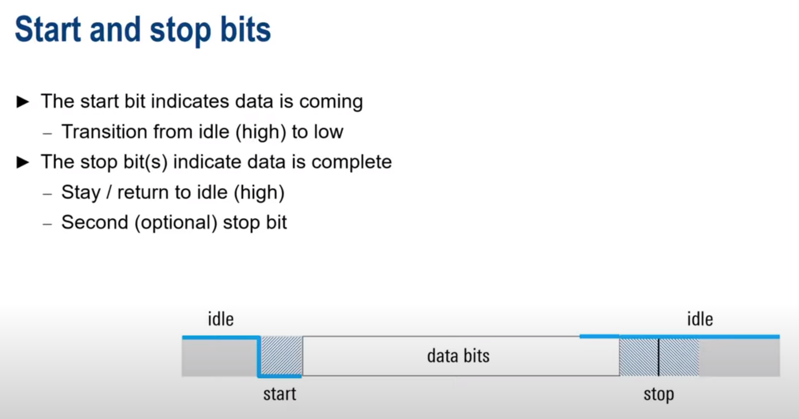
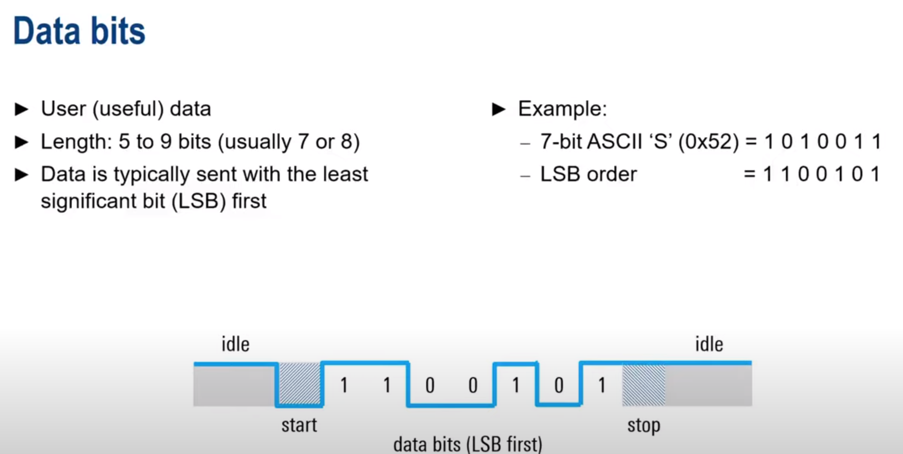
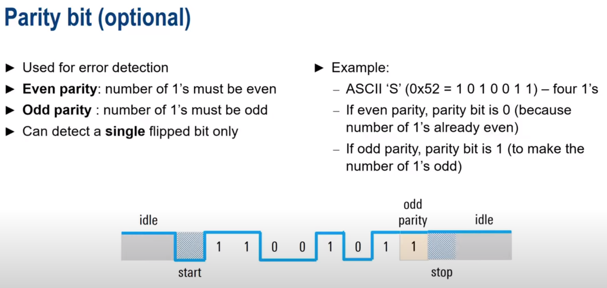

## UART

UART - universal asynchronous receiver/transmitter. It is a hardware module that allows the microcontroller to
communicate with other devices, such as a computer, using serial communication. UART is a full-duplex communication
protocol, meaning that it can send and receive data simultaneously.

can be simplex(one direction), half-duplex(two directions, but only one at a time) or full-duplex(two directions
simultaneously).

Data transfer with frames. Each frame consists of a start bit, data bits, an optional parity bit, and stop bits.

What should be implemented:

- transmit at the same speed (baud rates: 4800,9600, 19200, 57600, 115200)
- use the same frame structure / parameters

